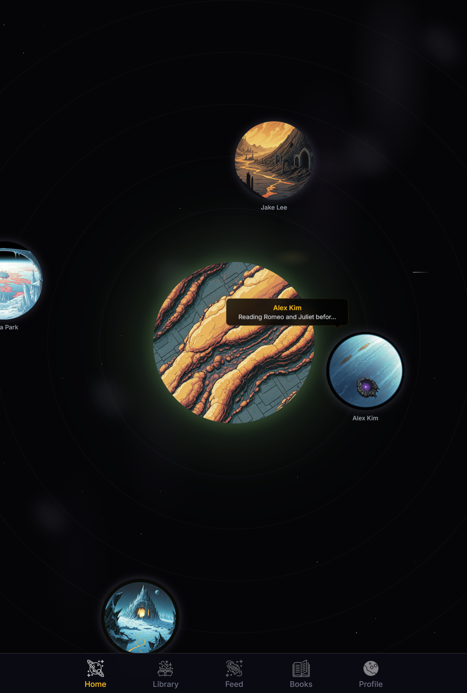
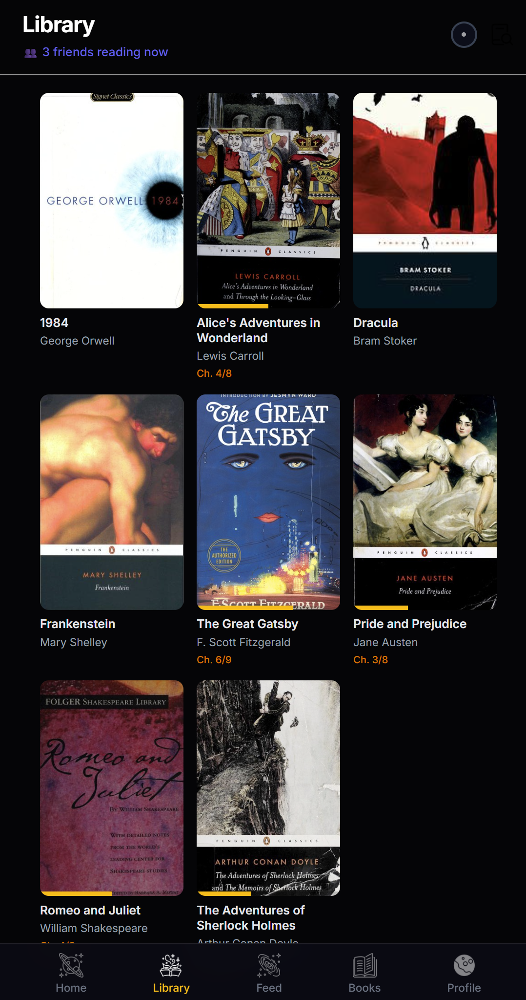
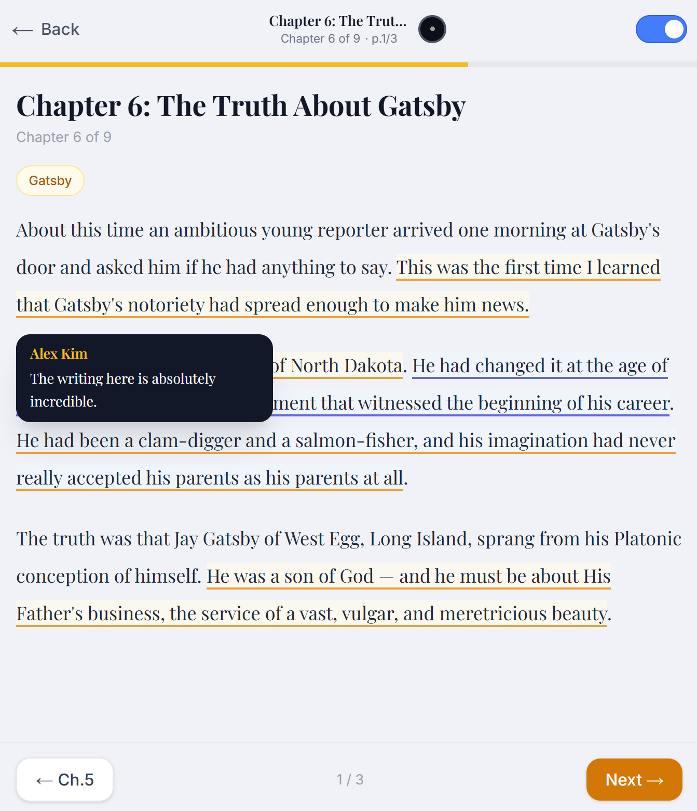
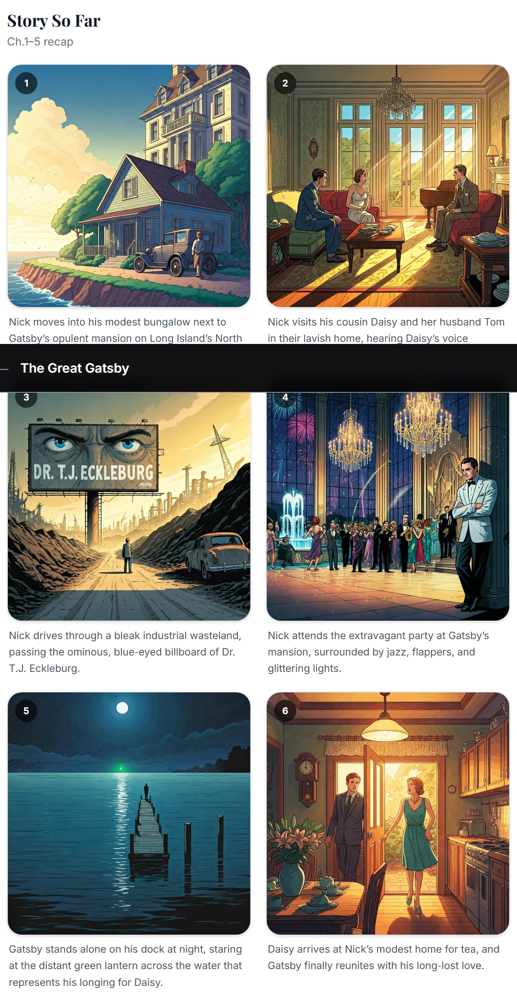

# Booky -Social Reading, Reimagined

> **YHack 2026** -Turn reading into a shared adventure with AI-powered insights, voice Q&A, and a social solar system.

Booky transforms solitary reading into a connected experience. Readers highlight passages, discuss with friends, make story-branching choices (Detroit: Become Human style), and explore an AI-generated solar system that visualizes reading compatibility with friends.

## Demo

[](https://www.youtube.com/watch?v=DfWic5WwqOg)

## Screenshots

| Planet View | Library |
|:-:|:-:|
|  |  |

| Book Viewer | AI Story Recap |
|:-:|:-:|
|  |  |

## Key Features

| Feature | Description |
|---------|-------------|
| **Planet View** | 3D solar system where your planet orbits among friends -proximity = reading similarity |
| **Social Reading** | See friends' highlights overlaid on the text, leave comments, react with likes |
| **Story Choices** | Detroit-style branching decisions at chapter ends -see what friends chose |
| **Voice Ask (Gemini)** | Select a passage, ask a question by voice, get a spoken AI answer |
| **AI Reading Notes** | Auto-generated reading reports comparing your insights with friends' |
| **Story Recap Comics** | AI-generated 6-panel comic recaps of each chapter |
| **Character Portraits** | AI-illustrated character profiles that update as you read (spoiler-free) |
| **Author Chat** | Chat with an AI embodying the author's voice and perspective |
| **Constellation Map** | Full-screen star map showing reader similarity clusters |
| **Activity Feed** | Social feed with spoiler blur for content you haven't reached yet |

## AI Stack

- **[K2 Think V2](https://cloud.google.com/vertex-ai)** -Character descriptions, reading questions, author chat, story choices, reading notes, chapter recaps
- **[Gemini 2.0 Flash](https://ai.google.dev/)** -Voice Q&A pipeline (speech recognition → answer generation → text-to-speech)
- **[Vertex AI Imagen](https://cloud.google.com/vertex-ai/docs/generative-ai/image/overview)** -Character portraits, comic panels, planet textures

## Tech Stack

| Layer | Technology |
|-------|------------|
| Frontend | Next.js 16, React 19, Tailwind CSS, Framer Motion, D3.js |
| 3D | @react-three/fiber, @react-three/drei |
| Backend | FastAPI, Python 3.11 |
| Database | Firebase Firestore (cloud NoSQL) |
| Auth | Firebase Auth (Google OAuth) |
| Vector DB | ChromaDB (local persistent) |
| IDE | Zed |

## Prerequisites

- **Node.js** 18+
- **Python** 3.11+
- **npm** 9+
- Firebase project with Firestore + Auth enabled

## Getting Started

### 1. Clone

```bash
git clone https://github.com/son-engr-kr/booky-yhack.git
cd booky-yhack
```

### 2. Backend

```bash
cd backend

# Create virtual environment
py -3.11 -m venv .venv
source .venv/Scripts/activate   # Windows (Git Bash)
# .venv\Scripts\activate        # Windows (CMD)
# source .venv/bin/activate     # macOS / Linux

pip install -r requirements.txt
```

Create `backend/.env` from the example:

```bash
cp .env.example .env
```

| Variable | Description | Example |
|----------|-------------|---------|
| `FIREBASE_CREDENTIALS_PATH` | Path to service account JSON | `./firebase-service-account.json` |
| `CHROMA_PERSIST_DIR` | ChromaDB storage path | `./chroma_data` |
| `FRONTEND_URL` | Frontend URL for CORS | `http://localhost:3000` |

Place `firebase-service-account.json` in `backend/` (never commit this file).

```bash
python run.py
```

API: http://localhost:8001 | Docs: http://localhost:8001/docs

### 3. Frontend

```bash
cd frontend
npm install
```

Create `frontend/.env.local` from the example:

```bash
cp .env.local.example .env.local
```

| Variable | Description |
|----------|-------------|
| `NEXT_PUBLIC_FIREBASE_API_KEY` | Firebase web API key |
| `NEXT_PUBLIC_FIREBASE_AUTH_DOMAIN` | `<project>.firebaseapp.com` |
| `NEXT_PUBLIC_FIREBASE_PROJECT_ID` | Firebase project ID |
| `NEXT_PUBLIC_FIREBASE_STORAGE_BUCKET` | `<project>.firebasestorage.app` |
| `NEXT_PUBLIC_FIREBASE_MESSAGING_SENDER_ID` | Messaging sender ID |
| `NEXT_PUBLIC_FIREBASE_APP_ID` | Firebase app ID |
| `NEXT_PUBLIC_API_URL` | Backend API URL (`http://localhost:8001`) |

```bash
npm run dev
```

App: http://localhost:3000

## Project Structure

```
booky-yhack/
├── backend/
│   ├── app/
│   │   ├── main.py             # FastAPI application
│   │   ├── config.py           # Settings (pydantic-settings)
│   │   ├── database.py         # Firebase + ChromaDB init
│   │   ├── auth_middleware.py   # Token verification
│   │   ├── routers/            # API endpoints
│   │   │   ├── ai.py           # AI chat, voice Q&A
│   │   │   ├── books.py        # Book CRUD
│   │   │   ├── reading.py      # Reading progress
│   │   │   ├── highlights.py   # Highlights & comments
│   │   │   ├── choices.py      # Story branching choices
│   │   │   ├── comic.py        # AI comic generation
│   │   │   ├── feed.py         # Social activity feed
│   │   │   ├── friends.py      # Friend management
│   │   │   ├── planet.py       # Planet/solar system data
│   │   │   └── reading_notes.py# AI reading reports
│   │   └── services/           # Business logic
│   │       ├── gemini.py       # Gemini API integration
│   │       ├── k2.py           # K2 Think V2 integration
│   │       ├── comic_service.py
│   │       ├── character_service.py
│   │       ├── planet_image_service.py
│   │       └── portrait_service.py
│   ├── scripts/
│   │   └── pull_firestore.py   # Firestore data export
│   ├── requirements.txt
│   └── run.py
├── frontend/
│   ├── src/
│   │   ├── app/                # Next.js pages
│   │   │   ├── planet/         # 3D solar system view
│   │   │   ├── library/        # Book library & reader
│   │   │   ├── feed/           # Social activity feed
│   │   │   ├── friends/        # Friend list
│   │   │   ├── constellation/  # Star map visualization
│   │   │   ├── my-books/       # Personal bookshelf
│   │   │   └── profile/        # User profile
│   │   ├── components/         # React components
│   │   ├── lib/                # API client, Firebase init
│   │   └── stores/             # Zustand state management
│   └── public/assets/          # Static assets
├── docs/images/                # README screenshots
└── README.md
```

## License

This project was built for YHack 2026.
